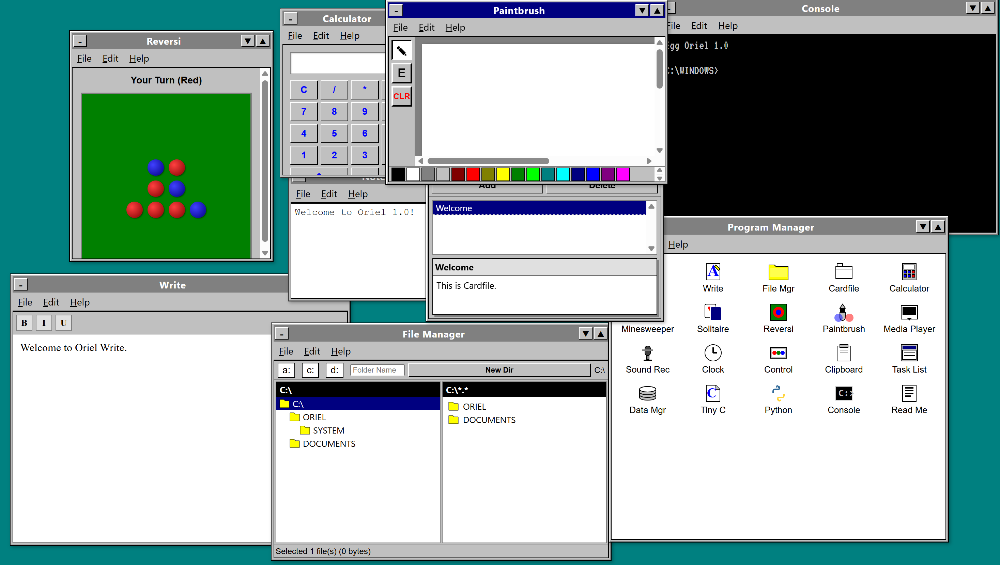

# Oriel

Oriel is a small retro desktop simulation built with vanilla HTML, CSS, and JavaScript.

## FTP client

This repository also includes a small Node script that wraps the [`ftp`](https://www.npmjs.com/package/ftp) (node-ftp) library for quick testing against FTP servers.

1. Install dependencies:

   ```bash
   npm install
   ```

2. Run the client with your server credentials, choosing a list, download, or upload action:

   ```bash
   node ftp-client.js --host ftp.example.com --user demo --password demo --list /
   node ftp-client.js --host ftp.example.com --user demo --password demo --download /remote/file.txt --dest ./file.txt
   node ftp-client.js --host ftp.example.com --user demo --password demo --upload ./local.txt --dest /incoming/local.txt
   ```
