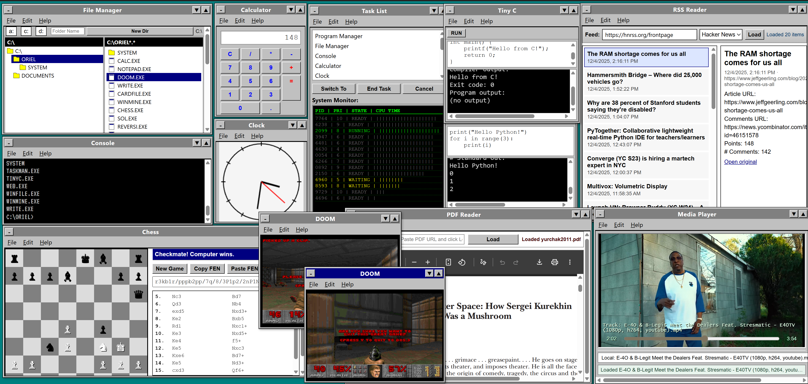

# Oriel


**[Try the Live Demo!](https://seanwevans.github.io/Oriel/)**

Oriel is a high-fidelity retro desktop simulation built with a focus on modularity and system-level abstraction. Unlike static "retro sites," Oriel implements a simulated kernel, a virtual filesystem with native mounting capabilities, and a priority-based process scheduler.

## 🚀 Getting Started

Oriel is built using **Vite** for a modern development experience with vanilla web technologies.

### Prerequisites

* Node.js (Latest LTS recommended)
* npm or yarn

### Installation

1. Clone the repository.
2. Install dependencies:
```bash
npm install

```


### Development

Launch the development server:

```bash
npm run dev

```

### Production Build

Compile the project for deployment:

```bash
npm run build

```

### Development and Testing Commands

Run the ESLint checks for the vanilla ES module source tree:

```bash
npm run lint

```

Run the native Node.js test suite:

```bash
npm test

```

Run the full local verification sequence, including linting, tests, and the production build:

```bash
npm run check

```

## 🛠 Core Architecture

The system is designed around a decoupled "App Host" model that provides applications with access to shared system services.

* **Simulated Kernel:** Manages a collection of virtual processes with a tick-based scheduler (200ms intervals) that simulates CPU time and process states (READY, RUNNING, WAITING).
* **Virtual Filesystem:** Supports a standard mock filesystem, JSON-based export/import, and native folder mounting using the File System Access API where supported.
* **App Registry:** A centralized hub that maps application types to their `BaseApp` classes, allowing for easy expansion.
* **Persistent State:** Saves and restores desktop configuration, window positions, and system settings across sessions.
* **Integrated Audio Engine:** Provides system-wide volume control and tracks media playback across different application windows.

> 📐 For a graphical walkthrough of the topology — system components, boot sequence, the app-registration pipeline, and the `BaseApp` lifecycle — see **[docs/ARCHITECTURE.md](docs/ARCHITECTURE.md)**.

## 📂 Application Catalog

Oriel features a vast library of pre-installed applications spanning several categories.

### Productivity & Utilities

* **Write & Notepad:** Tools for rich-text and plain-text document editing.
* **Calc & TI-83:** Functional arithmetic and graphing calculator emulations.
* **PDF Reader & Markdown Viewer:** Inline document viewers for common formats.
* **Cardfile:** A digital rolodex for managing small notes.
* **Character Map:** A utility to browse and copy symbols from various character sets.
* **Sheets:** A Lotus 1-2-3 / Excel-style spreadsheet with a formula bar (cell references, ranges, and aggregate functions).

### Games & Simulations

* **Classics:** DOOM, Minecraft Classic, Minesweeper, Solitaire, SkiFree, and Tetris.
* **Creative Play:** Line Rider, Sandspiel (2D/3D), and Angry Birds.
* **Logic & Puzzles:** Chess, Sudoku, Kakuro, and Reversi.
* **Simulation:** SimCity, Cannon Duel, Pinball, and Conway's Game of Life.

### Development & Systems

* **Tiny C & Tiny Python:** Integrated playgrounds for C and Python scripting.
* **Shader Lab:** A GLSL playground for real-time fragment shader experimentation.
* **Postgres:** A SQL console for issuing queries against a virtual database.
* **Hex Editor:** Inspect and modify raw byte data.
* **JSON Formatter:** Pretty-print, minify, and validate JSON with in-place error locations.
* **Process Monitor:** A live view of the simulated kernel's scheduler — per-state tiles, a load sparkline, and a CPU-sorted process table.
* **Packet Lab:** A visualizer for network flow and packet simulations.
* **Oriel VM:** A recursive window that runs a nested instance of the Oriel environment.

### Graphics & Design

* **Paint & Photoshop:** Bitmap editors for freehand and layered artwork.
* **Pixel Studio & Whiteboard:** A pixel-art grid and an infinite sketch canvas.
* **Color Picker:** RGB/HSL sliders, a hex field, live preview, and a saved-swatch palette.

### Multimedia & Social

* **Music & Audio:** Beat Lab, MIDI Sequencer, Tracker, and a functional Spotify player.
* **Communication:** IRC Client, Discord (API-driven), Messenger, and a simulated BBS Dialer.
* **Radio:** Global station streaming via Radio Garden and Radio Browser.
* **News:** RSS Reader and NetNews (Usenet-style) readers.

## 🧑‍💻 Developer Notes

### The app lifecycle contract

Every app extends `BaseApp` and exposes three hooks. The migration off the old
`LegacyFunctionApp` wiring is complete — all manifest entries use `appClass`, and
`src/apps/lifecycleContract.test.js` enforces the rules below against every
registered app, so a new app cannot quietly break them:

- **`getWindowContent()` returns markup and nothing else.** No listeners on
  `window` or `document`, no timers, no animation frames, no `fetch`, no audio
  contexts. Listeners bound to elements the method itself creates are fine —
  those are released with the window's DOM. Everything else outlives the window
  and must move to `mount()`.
- **`mount()` wires runtime behavior**, after the window element exists.
- **`dispose()` releases everything**, and must be safe to call on an app that
  was never mounted — a window can be closed while its chunk is still loading.

Register cleanup through the `BaseApp` helpers rather than by hand: `listen()`,
`setInterval()`, `setTimeout()`, `requestAnimationFrame()`, `trackObjectUrl()`,
`trackMediaElement()`, `trackAbortController()`, `trackMediaStream()`,
`trackAudioContext()`, and `createBroadcastChannel()`. Each registers a
disposable that `dispose()` drains automatically.

When an app owns a resource category the helpers do not cover, add a regression
test alongside the ones in `src/apps/resourceCleanup.test.js` proving `dispose()`
releases it.

## ⚙️ Configuration

Many network-dependent features can be configured via environment variables in a `.env` file without changing the source code:

| Variable | Description | Default |
| --- | --- | --- |
| `VITE_BROWSER_HOME` | Default landing page for the internal Web Browser. | `https://example.com/` |
| `VITE_BROWSER_PROXY_PREFIX` | Prefix for proxying browser requests. | `https://r.jina.ai/` |
| `VITE_RADIO_BROWSER_BASE` | Base URL for the Radio Browser API. | `https://de1.api.radio-browser.info/json` |
| `VITE_RSS_PROXY_ROOT` | Proxy URL used to fetch RSS/Atom feeds. | `https://api.allorigins.win/raw?url=` |

## 🧪 Technical Stack

* **Framework:** Vanilla JavaScript (ES Modules)
* **Graphics:** Three.js for 3D simulations (Sandspiel3D, Radio Garden)
* **Build Tool:** Vite
* **Testing:** Native Node.js test runner
