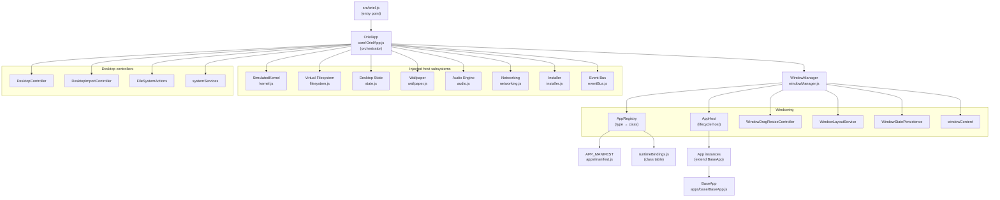
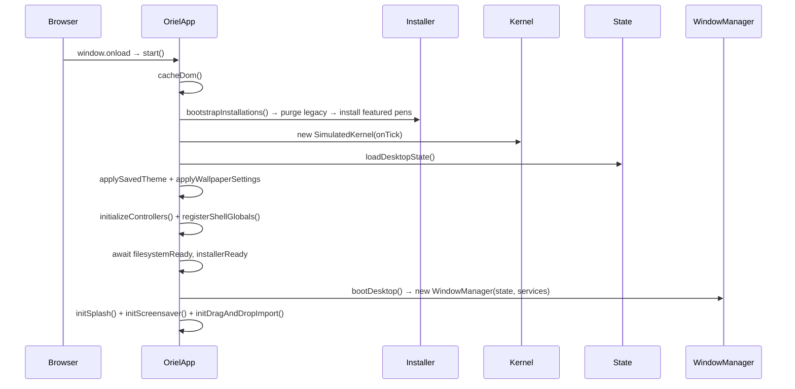
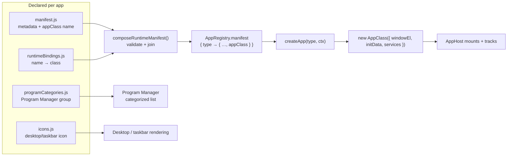
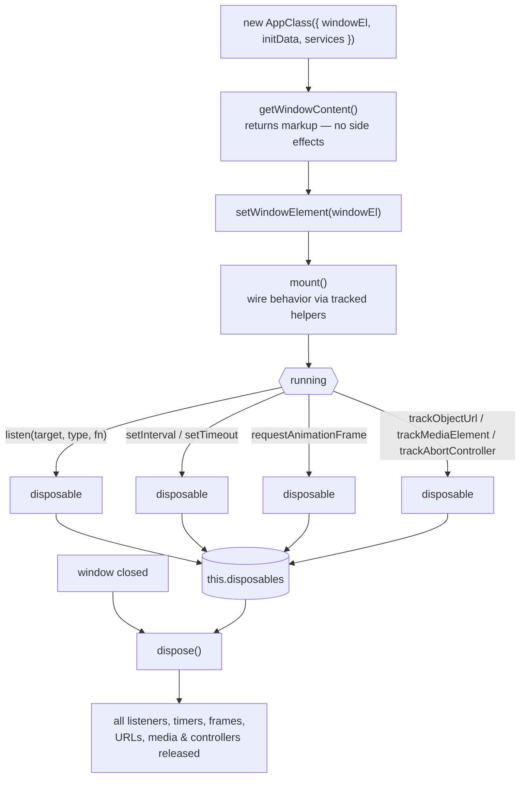

# Oriel Architecture

Oriel is a retro desktop simulation built with vanilla ES modules and Vite. It
models a small operating system in the browser: a boot sequence, a simulated
kernel with a process scheduler, a virtual filesystem, a window manager, and a
registry of self-contained applications that share host services.

This document maps the project's topology. The diagrams render on GitHub and in
any Mermaid-aware viewer.

---

## 1. System topology

The entry point (`src/oriel.js`) constructs a single `OrielApp` orchestrator,
injecting every host subsystem as a dependency. `OrielApp` owns the kernel and
the window manager; the window manager owns app instantiation through the
`AppRegistry` and `AppHost`.



---

## 2. Boot sequence

`window.onload` calls `OrielApp.start()`, which bootstraps installed apps, spins
up the kernel, restores saved desktop state, applies theme and wallpaper, wires
the desktop controllers, waits for the filesystem, then boots the desktop and
its shell affordances (splash, screensaver, drag-and-drop import).



---

## 3. Application registration pipeline

Each app is declared in four places, then resolved into a live class at runtime.
`composeRuntimeManifest` joins the metadata in `APP_MANIFEST` with the class
table in `runtimeBindings.js`, validating that every declared `appClass` has a
binding. `AppRegistry.createApp(type)` constructs the class; `AppHost` drives its
lifecycle.



> **Adding an app:** create `apps/<name>.js` exporting a `BaseApp` subclass, then
> register it in `manifest.js`, `runtimeBindings.js`, `programCategories.js`, and
> `icons.js`. `AppRegistry.test.js` and `programCategories.test.js` enforce that
> every manifest entry resolves a class and belongs to exactly one category.

---

## 4. App lifecycle (`BaseApp`)

Apps expose only three lifecycle hooks to the host. `getWindowContent()` must be
side-effect free (markup only); `mount()` attaches behavior after the window
element exists; `dispose()` releases every resource. `BaseApp` provides tracked
wrappers (`listen`, `setInterval`, `requestAnimationFrame`, `trackObjectUrl`,
`trackMediaElement`, `trackAbortController`, …) so cleanup is automatic.



---

## 5. Runtime services

The kernel and window manager inject a shared `services` bag into every app
(via the `AppRegistry` → `AppHost` construction path). Apps should use these
injected dependencies instead of importing host singletons.

| Service | Purpose |
| --- | --- |
| `windowManager` | Open, close, focus, and restore windows |
| `kernel` | The simulated process scheduler (`processes`, ticks) |
| `publish` / `subscribe` | Event bus for cross-window messaging (`fs:change`, `network:config-update`, …) |
| `filesystem` / `fileSystemActions` | Virtual FS reads, writes, import/export, native mount |
| `controlPanelContext` | Shared control-panel state merged in at construction |

The `SimulatedKernel` runs a tick-based scheduler (200 ms) that advances process
states (`READY` → `RUNNING` → `WAITING`) and calls back on each tick — for
example, to refresh the Task List and Process Monitor process views.

---

## 6. Directory map

```
src/
  oriel.js                 Entry point; builds OrielApp with injected deps
  core/
    OrielApp.js            Orchestrator: boot, controllers, services
    AppRegistry.js         Resolves manifest + bindings → app classes
    AppHost.js             Instantiates and drives app lifecycles
    DesktopController.js   Desktop, icons, context menu
    systemServices.js      Shared services bag
  windowManager.js         Windows, focus, z-order; owns AppHost + AppRegistry
  window/                  Drag/resize, layout, persistence, DOM helpers
  kernel.js                Simulated process scheduler
  filesystem.js            Virtual filesystem (+ native mount)
  state.js                 Desktop state load/save
  audio.js  wallpaper.js  networking.js  installer.js  eventBus.js
  apps/
    base/BaseApp.js        App lifecycle contract
    manifest.js            App metadata + appClass names
    runtimeBindings.js     appClass name → class table
    programCategories.js   Program Manager grouping
    <app>.js               ~70 self-contained apps
  icons.js                 SVG icons keyed by app type
  oriel.css                All styles
```

See the repository [`README.md`](../README.md) for the application catalog and
developer commands.
